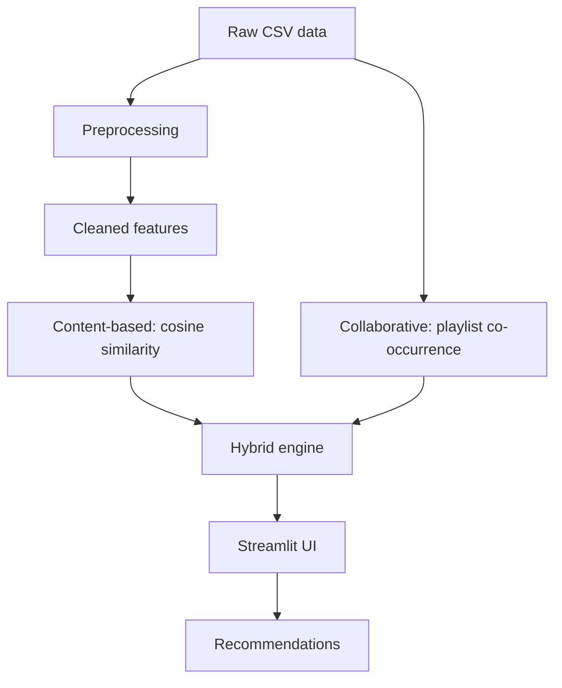
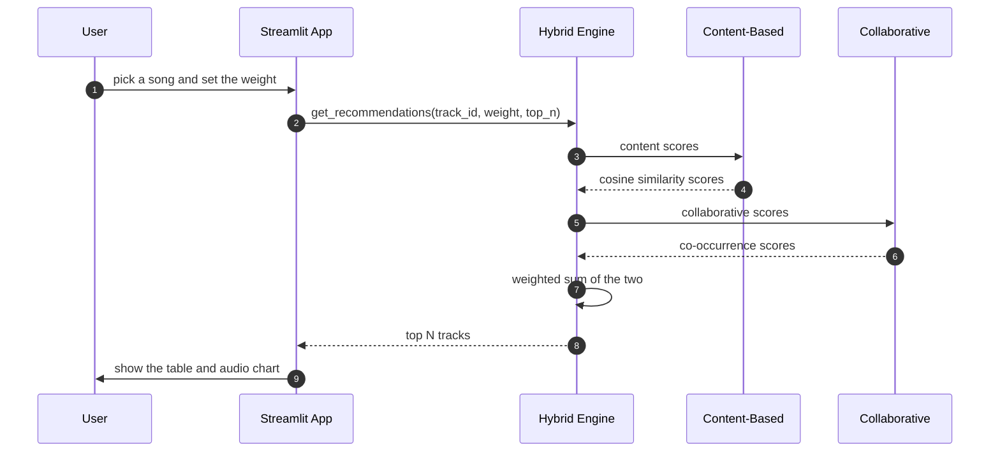

# HarmonyMix - Hybrid music recommendation system

A music recommendation system built on Spotify track and playlist data. You pick a
song and it suggests similar ones. It has three recommenders — content-based,
collaborative, and a hybrid of the two — behind a Streamlit interface, with a local
DVC preprocessing stage, a Dockerfile, and a CI workflow that runs the tests and
builds the image.

## Contents
1. [Overview](#overview)
2. [Dataset](#dataset)
3. [Architecture](#architecture)
4. [Project structure](#project-structure)
5. [Features](#features)
6. [How a recommendation is made](#how-a-recommendation-is-made)
7. [Tech used](#tech-used)
8. [Installation](#installation)
9. [Running the app](#running-the-app)
10. [Deployed demo](#deployed-demo)
11. [Results](#results)
12. [Limitations](#limitations)
13. [Future improvements](#future-improvements)

## Overview
There are a lot of songs and it is hard to find new ones you like. This project
gives song suggestions from a track you already like. It uses:

* **Content-based filtering** — finds songs with similar audio features
  (danceability, energy, acousticness, and so on), tags, and artist.
* **Collaborative filtering** — finds songs that show up together in the same
  playlists/users' listening history.
* **Hybrid** — blends the two so new songs with no listening history still get
  reasonable suggestions, with a slider to control the mix.

## Dataset

Two CSVs, expected at `data/raw/tracks.csv` and `data/raw/playlists.csv`:

1. **`tracks.csv`** (~50k songs): audio features (danceability, energy, key,
   loudness, speechiness, acousticness, instrumentalness, liveness, valence, tempo)
   plus metadata (name, artist, tags, genre, year, duration).
2. **`playlists.csv`** (~9.7M rows): `user_id`/`track_id`/`playcount`. Each user is
   treated like a playlist — tracks that appear together across users give the
   collaborative co-occurrence signal.

The schema matches Kaggle's Spotify-audio-features-plus-listening-history datasets
(commonly distributed as `Music Info.csv` + `User Listening History.csv`) — any
dataset with the same columns works, just rename the files to match.

**This dataset (~600 MB combined) is intentionally not committed to this
repository** — it's too large for a Git repo. To run with real data, download it
and place the two files under `data/raw/`. Fitted models (`models/*.pkl`) are not
committed either; they're generated locally the first time the app runs and then
cached to disk.

If the full dataset is missing, the app runs on the committed demo bundle instead
(see [Deployed demo](#deployed-demo)). The header says which of the two you are
looking at.

## Architecture



## Project structure

```
app/                    Streamlit UI
  app.py                Main page: search a song, tune the weight, see recommendations
  pages/                About and Explore-the-dataset pages
  components/           Reusable UI pieces (track card, audio radar chart)
src/
  preprocessing/        Cleans raw data, builds the feature transformer
  recommenders/         Content-based, collaborative, and hybrid engines + explanations
  evaluation/           Hit-Rate/Coverage/Diversity/Novelty evaluation
  pipelines/            DVC preprocessing entry point
  utils/                Model save/load helpers
tests/                  Pytest suite for the recommenders and evaluation
notebooks/              EDA and algorithm-comparison notebooks
data/
  raw/                  Place tracks.csv and playlists.csv here (not committed)
  processed/             Cleaned tracks CSV written by the preprocessing pipeline
  artifacts/             Misc pipeline outputs
models/                 Fitted engines, cached as .pkl (not committed, rebuilt locally)
```

## Features
* Streamlit app to search a song, see recommendations, and move a slider to change
  the content/collaborative balance.
* Three recommenders: content-based, collaborative, and weighted hybrid.
* Plain-language explanation per recommendation, built from the same content/
  collaborative scores already computed — no extra model.
* Evaluation beyond accuracy: Hit-Rate/Coverage plus Diversity and Novelty, and a
  hybrid-weight sweep notebook showing what the weight actually trades off.
* A local DVC stage for the preprocessing step.
* `Dockerfile` and `docker-compose.yml` to run it in a container.
* GitHub Actions workflow that runs the tests and does a Docker build check.

## How a recommendation is made



## Tech used
* Python 3.9+
* Pandas, NumPy, scikit-learn, SciPy
* Streamlit for the interface, Plotly for the audio radar chart
* DVC for the local preprocessing stage
* Docker and Docker Compose
* GitHub Actions (tests + Docker build check)

## Installation

1. Clone the repo:
   ```bash
   git clone https://github.com/RNK26/HarmonyMix.git
   cd HarmonyMix
   ```

2. Make a virtual environment and install the requirements:
   ```bash
   python -m venv venv
   source venv/Scripts/activate  # Windows: venv\Scripts\activate
   pip install -r requirements.txt
   ```

3. Add the dataset: place `tracks.csv` and `playlists.csv` under `data/raw/` (see
   [Dataset](#dataset)). Without it the app runs on the smaller demo bundle that
   ships with the repo, which is real data, just less of it.

4. (Optional) Regenerate the cleaned tracks CSV via the local DVC stage:
   ```bash
   dvc repro
   ```
   This is optional — the app also does its own cleaning at startup if this step is
   skipped.

## Running the app

Locally:
```bash
streamlit run app/app.py
```

With Docker:
```bash
docker build -t harmonymix .
docker run -p 8501:8501 harmonymix
```

The recommendation engines are fitted once and cached to `models/*.pkl`; the first
run takes longer than later ones. Use the "Re-fit engines" button in the sidebar
after changing the dataset.

## Deployed demo

The hosted version does not run on the full dataset and I would rather say so than
have someone assume it does.

`playlists.csv` is 575 MB and the fitted collaborative engine is 250 MB. GitHub
rejects any file over 100 MB, so neither can live in the repo, and for a long time
the deployment had no data at all — it fell through to a synthetic sample that
invented track names like "Song 42" and returned zero for every collaborative
score. That fallback is gone. Inventing data is a worse failure than refusing to
start, so `load_tracks` now raises if it finds nothing.

In its place, `scripts/build_demo_bundle.py` writes two small files that are
committed:

| File | Contents | Size |
|---|---|---:|
| `data/tracks_demo.csv` | the 10,000 most-listened tracks, real names and audio features | 3.1 MB |
| `data/collab_matrix.npz` | their co-occurrence matrix, 100 neighbours per track | 2.9 MB |

Subsetting tracks on its own does not help, which surprised me. The co-occurrence
submatrix for the 1,000 most popular tracks is 99.5% dense — popular tracks appear
next to nearly everything — so it is 11.9 MB for a thousand songs and 232 MB for
five thousand. What makes it small is dropping each track's weak neighbours: 82
million non-zeros become 1 million, and 250 MB becomes 2.9 MB.

What actually differs from a local run: tracks outside a query's kept 100
neighbours score exactly 0 collaboratively rather than something small and
positive, so the hybrid blend sees a slightly sparser collaborative signal at the
edges. Measured across 300 sampled tracks against the full engine restricted to the
same 10,000-track catalogue, the demo reproduces the full top 10 exactly 297 times
out of 300, with 99.9% mean overlap.

Getting there needed one non-obvious detail. Truncating on the raw co-occurrence
count only managed 226/300 and 94.1% overlap, because the engine ranks on
`count / sqrt(freq_a * freq_b)`, not on the count. That normalisation lifts
neighbours that co-occur less often but are far less popular, and cutting on the
raw count throws some of them out before they can climb. The bundle therefore picks
which entries to keep using the normalised score, while still storing raw counts,
since raw counts are what the engine divides.

The other 20,459 tracks with listening history are simply absent from the hosted
catalogue, so cold-start behaviour is under-represented there compared to local.

Run it against the full data locally and none of this applies — the full pipeline
is untouched.

## Results

Quality is measured with a leave-one-out check on the listening data
(`src/evaluation/evaluate.py`, `pytest tests/` — 27 tests):

* **Content-based** — mean pairwise similarity on a random sample: 0.365 (nearest-
  neighbour mean 0.851), catalogue coverage@10: 0.019. Results lean toward the same
  artist and tags more than pure audio similarity, since those make up most of the
  feature matrix's columns.
* **Collaborative** — Hit-Rate@10 ≈ 0.154, Hit-Rate@20 ≈ 0.184 (500 sampled users),
  Coverage@10 ≈ 0.099, Coverage@20 ≈ 0.168.
* **Hybrid** — a tunable weighted sum of the two; the weight slider trades Hit-Rate/
  Diversity against Novelty (collaborative scores favor already-popular tracks, so
  leaning content-based spreads recommendations wider).
* **Cold start** — about 40% of the catalogue has no listening history at all. The
  hybrid engine detects this per query and falls back to a pure content-based score
  instead of penalizing the track for missing data it can't have.

## Limitations

* Collaborative filtering only works for tracks with playlist/listening history —
  new or obscure tracks fall back to content-only recommendations.
* Content-based recommendations lean toward the same artist and tags rather than
  pure audio similarity, since those dominate the feature matrix.
* Some tracks are missing a preview URL, so playback isn't always available.
* Metadata quality depends on the dataset — genre is missing on a large share of
  rows, so tags are used as the main text signal instead.
* Adding new songs requires rebuilding the models locally; there's no online/
  incremental learning or per-user personalization yet.
* The hosted demo runs on 10,000 of the 30,459 tracks that have listening history,
  with each track's 100 strongest neighbours kept. Top-10 recommendations match the
  full engine 99.9% of the time, but it is not the same thing as a local run — see
  [Deployed demo](#deployed-demo).

## Future improvements
* Faster similarity search with approximate nearest neighbours (FAISS or Annoy)
  instead of scanning the whole catalogue per query.
* Matrix factorization / implicit ALS for collaborative filtering instead of raw
  co-occurrence counts.
* A thumbs-up/thumbs-down feedback loop to adjust recommendations over time.
* More evaluation metrics, such as NDCG and Precision@K.
* Mood filtering using energy/valence thresholds, and lyrics embeddings as an extra
  content signal.

Live demo: https://harmonymix-bn6hwa7sxvg7yjybtemrsk.streamlit.app/

Run locally: clone the repo, `pip install -r requirements.txt`, then `streamlit run app/app.py`. It runs on the committed demo bundle if the full dataset isn't present.
