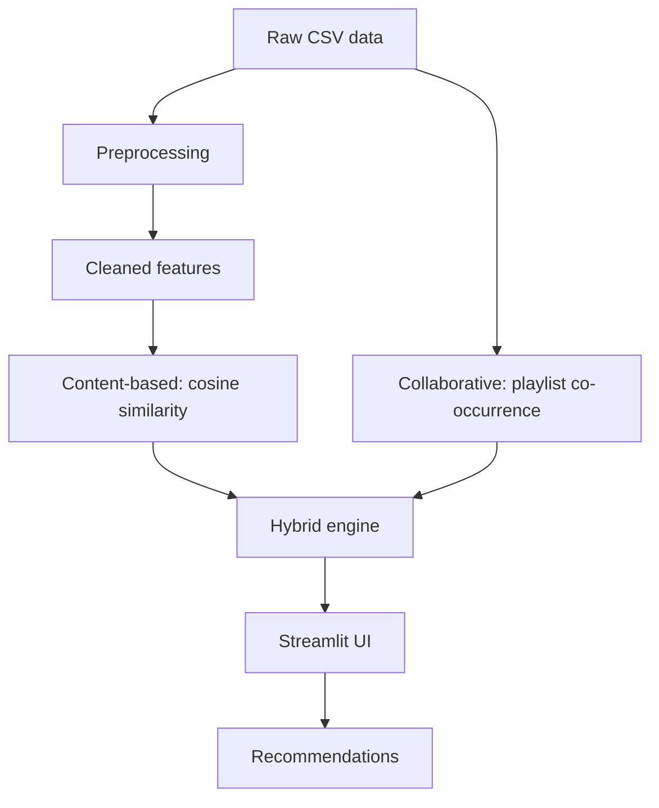
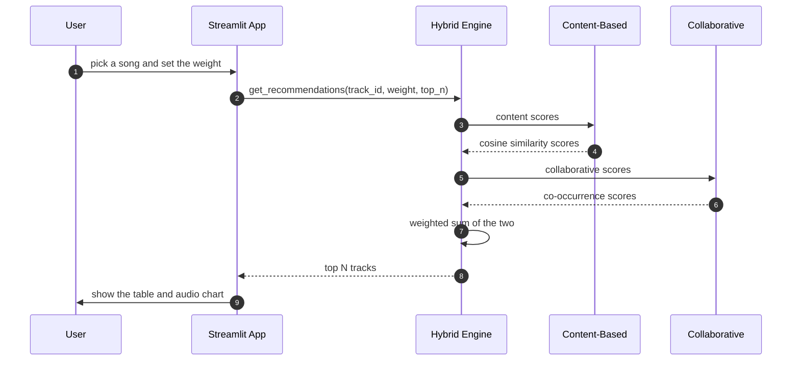

# HarmonyMix - Hybrid music recommendation system

A music recommendation system built on Spotify track and playlist data. You pick a
song and it suggests similar ones. It has three recommenders — content-based,
collaborative, and a hybrid of the two — behind a Streamlit interface, with a local
DVC preprocessing stage, a Dockerfile, and a CI workflow that runs the tests and
builds the image.

## Contents
1. [Overview](#overview)
2. [Dataset](#dataset)
3. [Architecture](#architecture)
4. [Project structure](#project-structure)
5. [Features](#features)
6. [How a recommendation is made](#how-a-recommendation-is-made)
7. [Tech used](#tech-used)
8. [Installation](#installation)
9. [Running the app](#running-the-app)
10. [Results](#results)
11. [Limitations](#limitations)
12. [Future improvements](#future-improvements)

## Overview
There are a lot of songs and it is hard to find new ones you like. This project
gives song suggestions from a track you already like. It uses:

* **Content-based filtering** — finds songs with similar audio features
  (danceability, energy, acousticness, and so on), tags, and artist.
* **Collaborative filtering** — finds songs that show up together in the same
  playlists/users' listening history.
* **Hybrid** — blends the two so new songs with no listening history still get
  reasonable suggestions, with a slider to control the mix.

## Dataset

Two CSVs, expected at `data/raw/tracks.csv` and `data/raw/playlists.csv`:

1. **`tracks.csv`** (~50k songs): audio features (danceability, energy, key,
   loudness, speechiness, acousticness, instrumentalness, liveness, valence, tempo)
   plus metadata (name, artist, tags, genre, year, duration).
2. **`playlists.csv`** (~9.7M rows): `user_id`/`track_id`/`playcount`. Each user is
   treated like a playlist — tracks that appear together across users give the
   collaborative co-occurrence signal.

The schema matches Kaggle's Spotify-audio-features-plus-listening-history datasets
(commonly distributed as `Music Info.csv` + `User Listening History.csv`) — any
dataset with the same columns works, just rename the files to match.

**This dataset (~600 MB combined) is intentionally not committed to this
repository** — it's too large for a Git repo. To run with real data, download it
and place the two files under `data/raw/`. Fitted models (`models/*.pkl`) are not
committed either; they're generated locally the first time the app runs and then
cached to disk.

If `data/raw/tracks.csv` is missing, the app falls back to a small synthetic sample
so it still runs — the UI marks this clearly as demo mode.

## Architecture



## Project structure

```
app/                    Streamlit UI
  app.py                Main page: search a song, tune the weight, see recommendations
  pages/                About and Explore-the-dataset pages
  components/           Reusable UI pieces (track card, audio radar chart)
src/
  preprocessing/        Cleans raw data, builds the feature transformer
  recommenders/         Content-based, collaborative, and hybrid engines + explanations
  evaluation/           Hit-Rate/Coverage/Diversity/Novelty evaluation
  pipelines/            DVC preprocessing entry point
  utils/                Model save/load helpers
tests/                  Pytest suite for the recommenders and evaluation
notebooks/              EDA and algorithm-comparison notebooks
data/
  raw/                  Place tracks.csv and playlists.csv here (not committed)
  processed/             Cleaned tracks CSV written by the preprocessing pipeline
  artifacts/             Misc pipeline outputs
models/                 Fitted engines, cached as .pkl (not committed, rebuilt locally)
```

## Features
* Streamlit app to search a song, see recommendations, and move a slider to change
  the content/collaborative balance.
* Three recommenders: content-based, collaborative, and weighted hybrid.
* Plain-language explanation per recommendation, built from the same content/
  collaborative scores already computed — no extra model.
* Evaluation beyond accuracy: Hit-Rate/Coverage plus Diversity and Novelty, and a
  hybrid-weight sweep notebook showing what the weight actually trades off.
* A local DVC stage for the preprocessing step.
* `Dockerfile` and `docker-compose.yml` to run it in a container.
* GitHub Actions workflow that runs the tests and does a Docker build check.

## How a recommendation is made



## Tech used
* Python 3.9+
* Pandas, NumPy, scikit-learn, SciPy
* Streamlit for the interface, Plotly for the audio radar chart
* DVC for the local preprocessing stage
* Docker and Docker Compose
* GitHub Actions (tests + Docker build check)

## Installation

1. Clone the repo:
   ```bash
   git clone https://github.com/NRK26/HarmonyMix.git
   cd HarmonyMix
   ```

2. Make a virtual environment and install the requirements:
   ```bash
   python -m venv venv
   source venv/Scripts/activate  # Windows: venv\Scripts\activate
   pip install -r requirements.txt
   ```

3. Add the dataset: place `tracks.csv` and `playlists.csv` under `data/raw/` (see
   [Dataset](#dataset)). Without it, the app still runs in demo mode with synthetic
   sample data.

4. (Optional) Regenerate the cleaned tracks CSV via the local DVC stage:
   ```bash
   dvc repro
   ```
   This is optional — the app also does its own cleaning at startup if this step is
   skipped.

## Running the app

Locally:
```bash
streamlit run app/app.py
```

With Docker:
```bash
docker build -t harmonymix .
docker run -p 8501:8501 harmonymix
```

The recommendation engines are fitted once and cached to `models/*.pkl`; the first
run takes longer than later ones. Use the "Re-fit engines" button in the sidebar
after changing the dataset.

## Results

Quality is measured with a leave-one-out check on the listening data
(`src/evaluation/evaluate.py`, `pytest tests/` — 27 tests):

* **Content-based** — mean pairwise similarity on a random sample: 0.365 (nearest-
  neighbour mean 0.851), catalogue coverage@10: 0.019. Results lean toward the same
  artist and tags more than pure audio similarity, since those make up most of the
  feature matrix's columns.
* **Collaborative** — Hit-Rate@10 ≈ 0.154, Hit-Rate@20 ≈ 0.184 (500 sampled users),
  Coverage@10 ≈ 0.099, Coverage@20 ≈ 0.168.
* **Hybrid** — a tunable weighted sum of the two; the weight slider trades Hit-Rate/
  Diversity against Novelty (collaborative scores favor already-popular tracks, so
  leaning content-based spreads recommendations wider).
* **Cold start** — about 40% of the catalogue has no listening history at all. The
  hybrid engine detects this per query and falls back to a pure content-based score
  instead of penalizing the track for missing data it can't have.

## Limitations

* Collaborative filtering only works for tracks with playlist/listening history —
  new or obscure tracks fall back to content-only recommendations.
* Content-based recommendations lean toward the same artist and tags rather than
  pure audio similarity, since those dominate the feature matrix.
* Some tracks are missing a preview URL, so playback isn't always available.
* Metadata quality depends on the dataset — genre is missing on a large share of
  rows, so tags are used as the main text signal instead.
* Adding new songs requires rebuilding the models locally; there's no online/
  incremental learning or per-user personalization yet.

## Future improvements
* Faster similarity search with approximate nearest neighbours (FAISS or Annoy)
  instead of scanning the whole catalogue per query.
* Matrix factorization / implicit ALS for collaborative filtering instead of raw
  co-occurrence counts.
* A thumbs-up/thumbs-down feedback loop to adjust recommendations over time.
* More evaluation metrics, such as NDCG and Precision@K.
* Mood filtering using energy/valence thresholds, and lyrics embeddings as an extra
  content signal.
